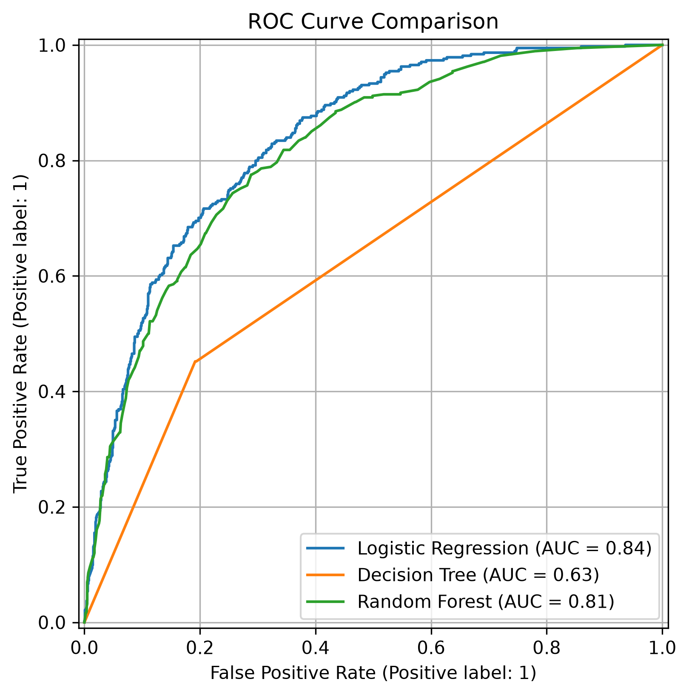
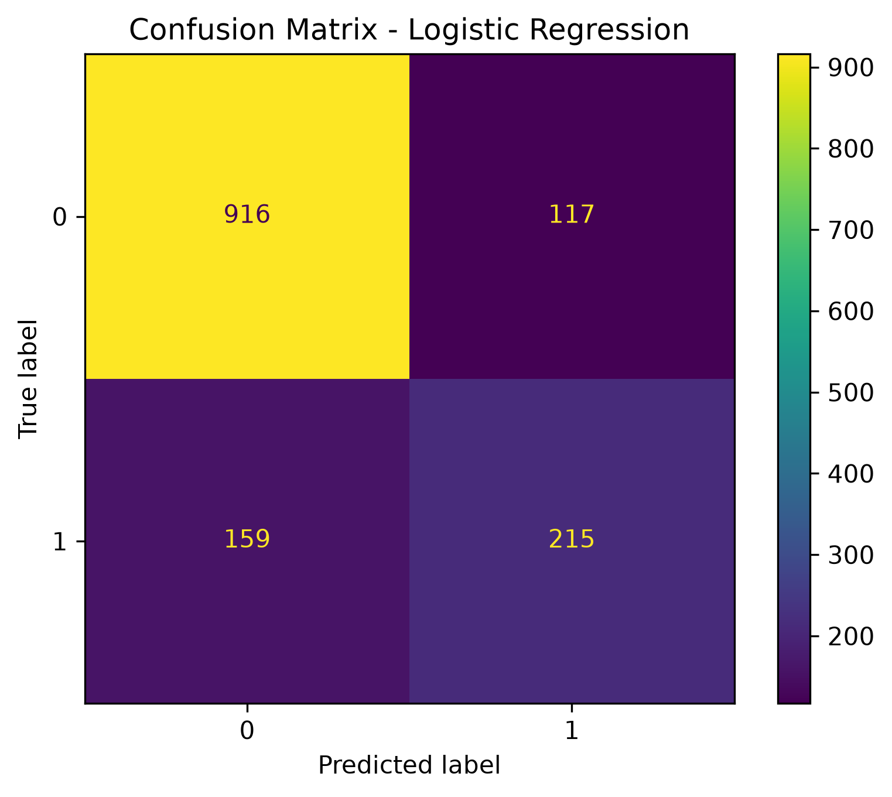
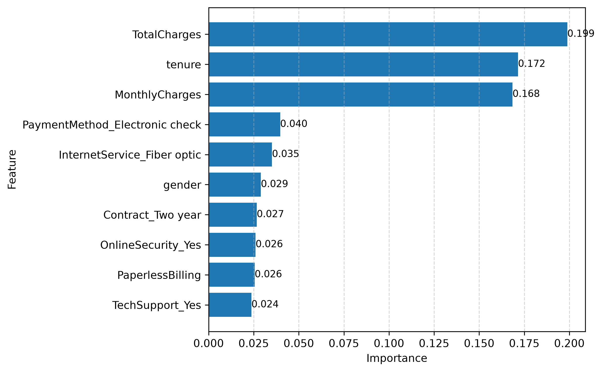

# 📊 Customer Churn Prediction

End-to-end Data Science project focused on predicting customer churn using Machine Learning and transforming the results into business insights through Power BI.


## 📊 Dashboard Preview


## ✨ Project Highlights

| Metric | Value |
|---|---:|
| Customers analyzed | 7,032 |
| Machine Learning models | 3 |
| Best model | Logistic Regression |
| Best ROC-AUC | 0.836 |
| Main database | SQLite |
| Business Intelligence | Power BI |

## 📖 Project Overview

Customer churn represents the loss of customers who stop using a company's products or services.

The objective of this project is to build an end-to-end Data Science pipeline capable of:

- storing and analyzing customer data with SQLite and SQL;
- cleaning and transforming the original dataset;
- training multiple classification models;
- evaluating model performance using business-relevant metrics;
- identifying the main factors associated with customer churn;
- communicating the results through an interactive Power BI dashboard.

## 🛠️ Tech Stack

- **Python:** data processing and pipeline development
- **Pandas:** data cleaning and transformation
- **SQLite:** structured data storage
- **SQL:** exploratory business analysis
- **Scikit-learn:** Machine Learning training and evaluation
- **Matplotlib:** technical model visualizations
- **Power BI:** interactive dashboards and business insights

## 🏗️ Project Pipeline

```text
Raw CSV Dataset
        │
        ▼
SQLite Database
        │
        ▼
SQL Business Analysis
        │
        ▼
Data Preprocessing
        │
        ▼
Feature Engineering
        │
        ▼
Model Training
        │
        ▼
Model Evaluation
        │
        ▼
Feature Importance
        │
        ▼
Power BI Dashboard
```

## 📂 Repository Structure

```text
customer-churn-prediction/
│
├── data/
│   ├── raw/
│   ├── processed/
│   └── results/
│
├── database/
│   └── customer_churn.db
│
├── images/
│   ├── dashboard_business_overview.png
│   ├── dashboard_ml_insights.png
│   ├── roc_curve_comparison.png
│   ├── confusion_matrix.png
│   └── feature_importance.png
│
├── powerbi/
│   ├── customer_churn_dashboard.pbix
│   └── customer_churn_powerbi.csv
│
├── src/
│   ├── 01_load_to_sqlite.py
│   ├── 02_sql_analysis.py
│   ├── 03_data_preprocessing.py
│   ├── 04_feature_engineering.py
│   ├── 05_train_models.py
│   ├── 06_model_evaluation.py
│   ├── 07_feature_importance.py
│   └── 08_export_powerbi.py
│
├── README.md
└── requirements.txt
```

## 📊 Dataset

The project uses the **Telco Customer Churn** dataset.

After preprocessing, the dataset contains:

- **7,032 customers**
- demographic information;
- account and contract information;
- internet and telephone services;
- payment methods;
- monthly and total charges;
- customer churn status.

The target variable is **`Churn`**, encoded as:

- `0`: Customer did not churn
- `1`: Customer churned

## 🗄️ SQL Analysis

The original CSV dataset is loaded into a SQLite database.

SQL queries are used to analyze:

- total number of customers;
- churn distribution;
- churn by contract type;
- average monthly charges by churn;
- churn by internet service;
- churn by payment method;
- average customer tenure by churn status.

## ⚙️ Data Preprocessing and Feature Engineering

The preprocessing pipeline includes:

- converting `TotalCharges` to numeric format;
- removing rows with invalid or missing total charges;
- encoding the target variable `Churn`;
- removing the unique customer identifier;
- encoding binary categorical variables;
- applying one-hot encoding to multi-category variables;
- exporting a Machine Learning-ready dataset.

## 🤖 Machine Learning Models

Three classification models were trained and compared:

1. Logistic Regression
2. Decision Tree
3. Random Forest

The train/test split uses:

- 80% training data;
- 20% testing data;
- stratification by the target variable;
- `random_state=42` for reproducibility.

Logistic Regression is implemented through a Scikit-learn pipeline that includes feature standardization.

## 📈 Model Results

| Model | Accuracy | ROC-AUC |
|---|---:|---:|
| Logistic Regression | **0.804** | **0.836** |
| Random Forest | 0.785 | 0.815 |
| Decision Tree | 0.713 | 0.630 |

### 🏆 Best Model

**Logistic Regression** was selected as the best predictive model because it achieved the highest ROC-AUC score.

The ROC-AUC metric was prioritized because it evaluates the model's ability to distinguish between customers who churn and customers who remain, independently of a single classification threshold.

### ROC Curve Comparison


### Confusion Matrix


The confusion matrix shows the classification performance of the selected Logistic Regression model on the test dataset.

## 🔍 Feature Importance

Random Forest was used specifically to calculate feature importance because it provides a direct tree-based importance score for each predictor.

This does not mean that Random Forest was selected as the final predictive model. Logistic Regression remained the best-performing model according to ROC-AUC.



## 📊 Power BI Dashboard

The Power BI report is divided into two main pages.

### Business Overview

The first page focuses on customer behavior and business indicators:

- total customers;
- churned customers;
- churn rate;
- average monthly charges;
- churn by contract type;
- churn by internet service;
- churn by payment method;
- interactive filters.


### Machine Learning Insights

The second page presents the technical model results:

- best predictive model;
- model comparison;
- Accuracy, Precision, Recall, F1 and ROC-AUC;
- feature importance;
- executive summary.


## 💡 Business Insights

The analysis identified several relevant churn patterns:

- Customers with month-to-month contracts show a higher churn rate.
- Customers with shorter tenure are more likely to leave.
- Electronic check payments are associated with higher churn.
- Contract type is one of the most influential churn predictors.
- Monthly charges and total charges provide relevant predictive information.
- Customers with longer-term contracts show stronger retention.

## ⚙️ Installation

### 1. Clone the repository

```bash
git clone https://github.com/SebasPortaBentzen/customer-churn-prediction.git
```

### 2. Enter the project directory

```bash
cd customer-churn-prediction
```

### 3. Create a virtual environment

```bash
python -m venv venv
```

### 4. Activate the environment

Windows:

```bash
venv\Scripts\activate
```

macOS or Linux:

```bash
source venv/bin/activate
```

### 5. Install the dependencies

```bash
pip install -r requirements.txt
```

## ▶️ Running the Project

Run the scripts from the root directory in the following order:

```bash
python src/01_load_to_sqlite.py
python src/02_sql_analysis.py
python src/03_data_preprocessing.py
python src/04_feature_engineering.py
python src/05_train_models.py
python src/06_model_evaluation.py
python src/07_feature_importance.py
python src/08_export_powerbi.py
```

The pipeline generates:

- the SQLite database;
- cleaned and encoded datasets;
- model evaluation tables;
- ROC curve comparison;
- confusion matrix;
- feature importance results;
- Power BI-ready data.

## 🔮 Future Improvements

- Apply cross-validation.
- Perform hyperparameter optimization.
- Evaluate XGBoost or LightGBM.
- Address class imbalance with model weights or resampling.
- Add model explainability using SHAP.
- Deploy the selected model through a REST API.
- Add automated tests and CI/CD.
- Monitor model performance and data drift.

## 👨‍💻 Author

**Sebastià Porta Bentzen**

Junior Data Scientist | AI Engineer

- GitHub: [SebasPortaBentzen](https://github.com/SebasPortaBentzen)
- LinkedIn: [Sebastià Porta Bentzen](www.linkedin.com/in/sebastiàportabentzen)